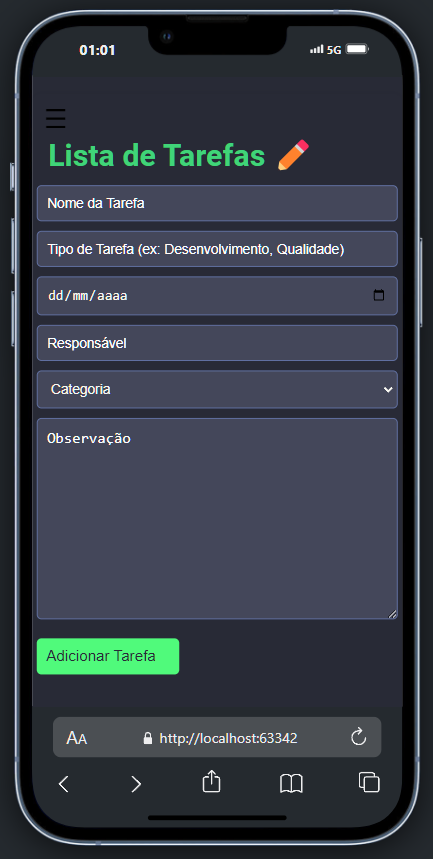
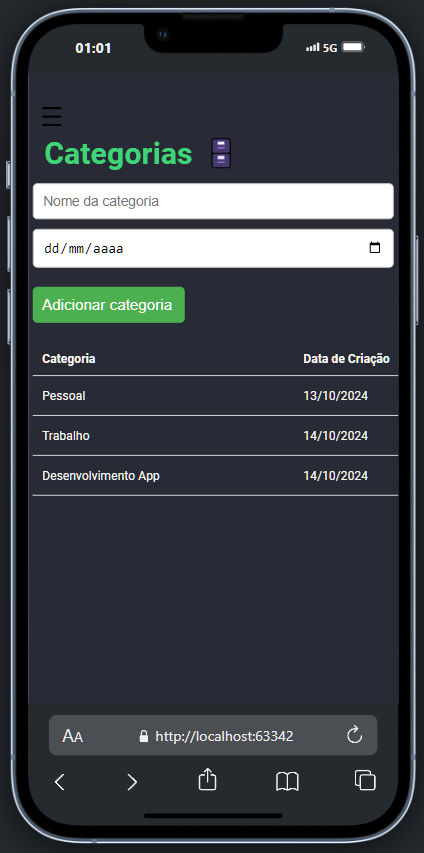
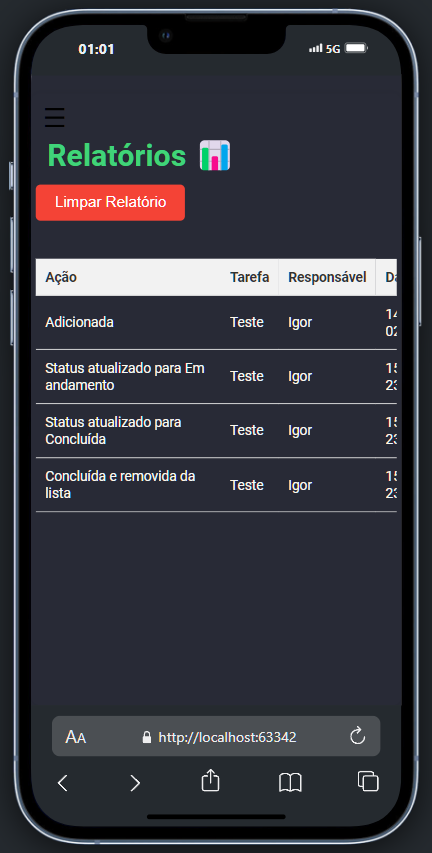
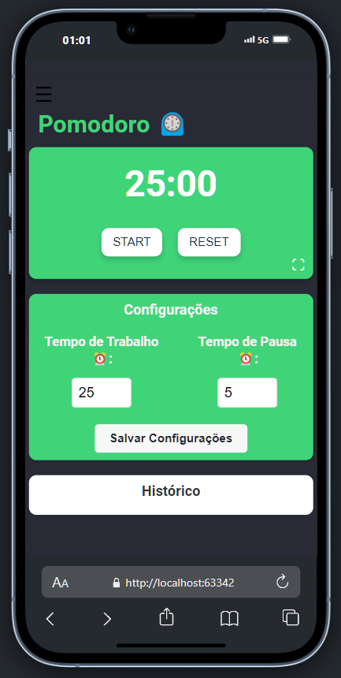

# 📝 To-Do List App

Uma aplicação moderna e intuitiva para gerenciamento de tarefas, combinando produtividade com a técnica Pomodoro.

[](https://opensource.org/licenses/MIT)

## 📋 Sumário
- [Visão Geral](#-visão-geral)
- [Recursos](#-recursos)
- [Tecnologias](#-tecnologias)
- [Começando](#-começando)
- [Arquitetura](#-arquitetura)
- [Contribuição](#-contribuição)
- [Licença](#-licença)

## 🎯 Visão Geral

O To-Do List App é uma solução completa para gerenciamento de tarefas e produtividade, combinando uma interface moderna e intuitiva com recursos avançados como timer Pomodoro, categorização de tarefas e geração de relatórios. A aplicação foi projetada pensando em usuários que buscam organizar suas atividades de forma eficiente, mantendo o foco e a produtividade.

### ✨ Principais Diferenciais
- Interface responsiva e intuitiva
- Armazenamento local seguro com IndexedDB
- Suporte a temas claro/escuro
- Sistema completo de categorização
- Timer Pomodoro integrado
- Geração de relatórios detalhados

## 🚀 Recursos

### Gerenciamento de Tarefas
Organize suas atividades com um sistema robusto de gerenciamento de tarefas:
- Criação de tarefas com campos personalizáveis
- Atribuição de responsáveis
- Datas de entrega
- Sistema de status
- Observações detalhadas



### Sistema de Categorias
Categorize suas tarefas de forma eficiente:
- Categorias personalizáveis
- Organização hierárquica
- Filtros avançados



### Relatórios Analíticos
Acompanhe seu progresso com relatórios detalhados:
- Histórico de ações
- Métricas de produtividade
- Exportação de dados



### Timer Pomodoro
Aumente sua produtividade com o timer Pomodoro integrado:
- Intervalos personalizáveis
- Notificações sonoras
- Histórico de sessões
- Estatísticas de uso



## 🛠 Tecnologias

O projeto foi desenvolvido utilizando tecnologias modernas e robustas:

-  Estruturação semântica
-  Estilização moderna
-  ES6+
-  Armazenamento local
-  Iconografia

## 🚦 Começando

### Pré-requisitos
- Navegador moderno com suporte a ES6+
- Node.js (opcional, para servidor local)

### Instalação

1. Clone o repositório
```bash
git clone https://github.com/SeuUsuario/ToDoListApp.git
```

2. Acesse o diretório
```bash
cd ToDoListApp
```

3. Inicie um servidor local (opcional)
```bash
# Usando Node.js
npx http-server

# Ou simplesmente abra o index.html no navegador
```

## 🏗 Arquitetura

```
ToDoListApp/
├── 📄 index.html          # Entrada da aplicação
├── 📂 js/
│   └── 📜 index.js       # Lógica principal
├── 📂 style/
│   └── 📜 Style.css      # Estilos globais
└── 📂 Imagens/           # Recursos estáticos
    ├── 🖼️ listaDeTarefas.png
    ├── 🖼️ categorias.png
    ├── 🖼️ relatorio.png
    └── 🖼️ pomodoro.png
```

### Componentes Principais

- **Interface Principal**: Implementada em HTML5 com design responsivo
- **Sistema de Armazenamento**: Utiliza IndexedDB para persistência local
- **Gerenciador de Estados**: Controle centralizado de estados da aplicação
- **Sistema de Temas**: Alternância dinâmica entre temas claro/escuro

## 👥 Contribuição

Contribuições são sempre bem-vindas! Para contribuir:

1. Fork o projeto
2. Crie uma branch para sua feature
```bash
git checkout -b feature/AmazingFeature
```
3. Commit suas mudanças
```bash
git commit -m 'Add: Amazing Feature'
```
4. Push para a branch
```bash
git push origin feature/AmazingFeature
```
5. Abra um Pull Request

### Diretrizes de Contribuição
- Siga o padrão de código existente
- Atualize a documentação conforme necessário
- Adicione testes para novas funcionalidades
- Mantenha os commits organizados e descritivos

## 📄 Licença

Ainda não possui liceça.

---

<p align="center">
  Desenvolvido com ❤️ por Igor Silva
</p>